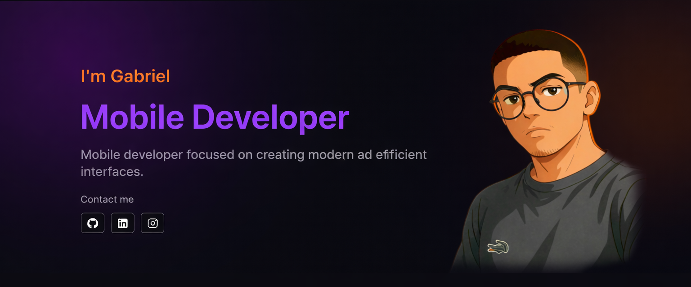
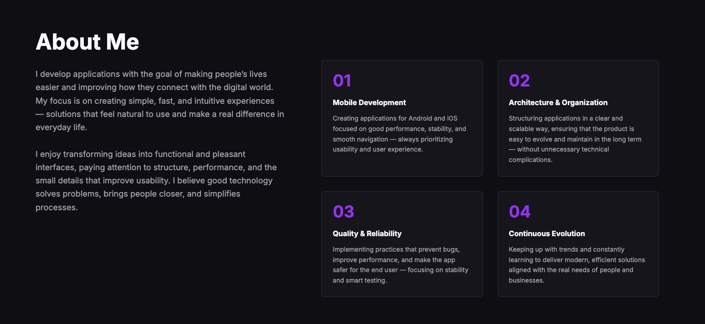
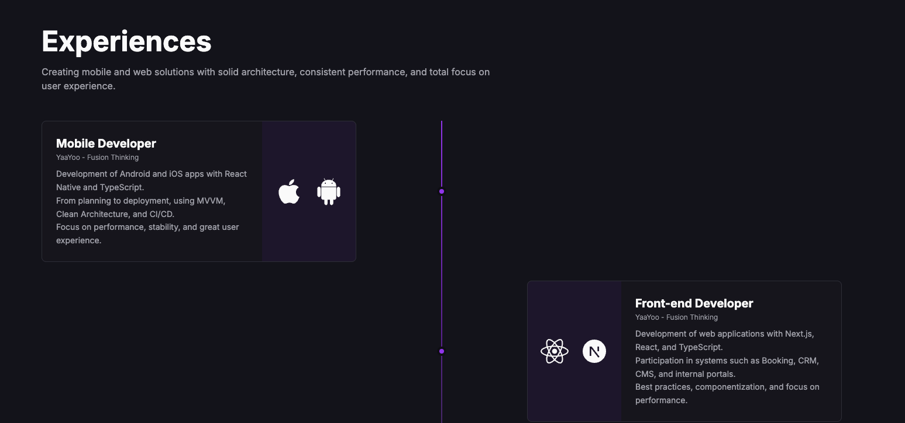
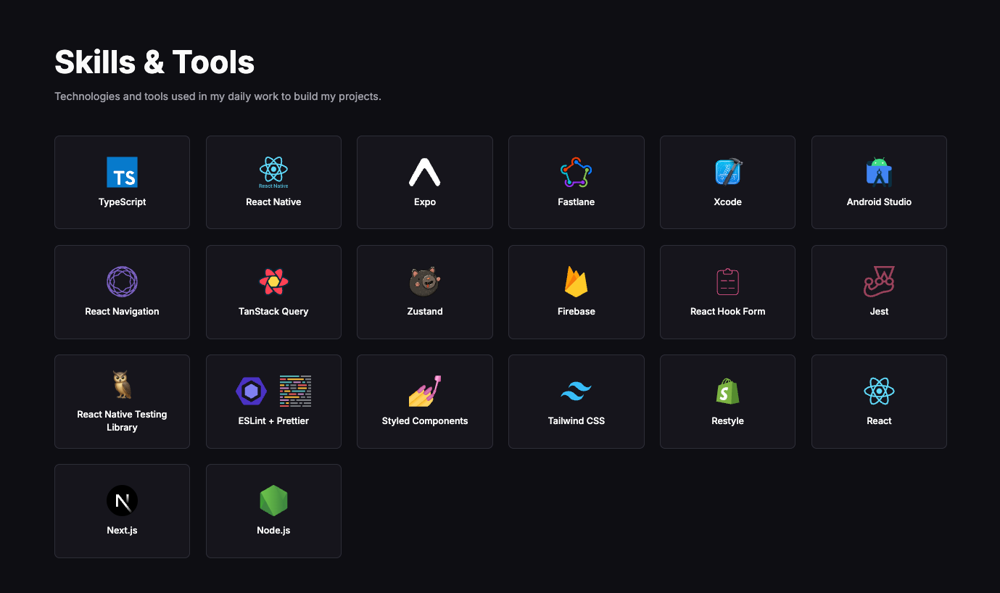
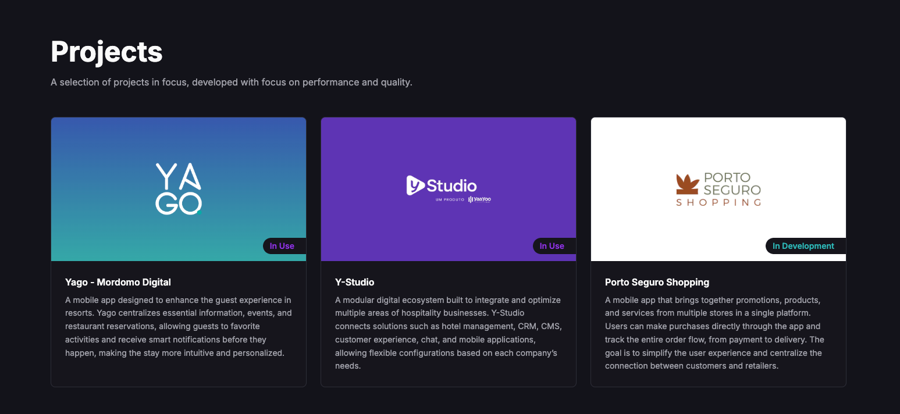

<!-- =========================
  Portfolio • Gabriel Aguiar
========================= -->

<p align="center">
  
</p>

<h1 align="center">Gabriel Aguiar</h1>

<p align="center">
  Developer focused on building modern, high-performance, and well-structured digital experiences.<br/>
  <sub>Mobile • Front-end • Software Engineering</sub>
</p>

<p align="center">
  
  
</p>

<p align="center">
  <a href="https://www.gabrielaguiar.dev">🌐 Portfolio</a> •
  <a href="#about">About</a> •
  <a href="#stack">Stack</a> •
  <a href="#screenshots">Screenshots</a> •
  <a href="#running-locally">Running locally</a>
</p>

---
<a id="about"></a>
## ✨ About

This repository contains the **source code of my personal portfolio**, where I showcase my projects, experience, and the way I approach software development.

The focus goes beyond visuals and includes:

- **Clean and scalable architecture**
- **Good coding practices**
- **Performance and user experience**
- **Long-term maintainability**

The portfolio works as a **technical business card**, showing not only _what_ I build, but _how_ I build it.

---

## 🎯 Project goals

- Centralize my projects and professional experience
- Demonstrate technical expertise in modern front-end development
- Serve as an evolving base for new experiments and ideas
- Make professional contact easier

---
<a id="stack"></a>
## 🧰 Stack

<p>
  
</p>

**Main technologies**

- **TypeScript**
- **React / Next.js**
- **Styled Components**
- **HTML5 & CSS3**
- **Deployment:** Vercel

> The stack was chosen with a strong focus on **developer experience**, **performance**, **SEO**, and **scalability**.

---

## 🧠 Technical highlights

- Well-defined component structure
- Responsive layout (mobile-first)
- Subtle animations focused on UX
- Basic SEO best practices applied
- Clean, readable, and maintainable code

---

## 🚀 Live version

🔗 **Access the portfolio:**  
👉 https://www.gabrielaguiar.dev

---
<a id="screenshots"></a>
## 🖼️ Screenshots

<p align="center">
  
  
  
  
</p>

---
<a id="running-locally"></a>
## ⚙️ Running locally

### Requirements

- Node.js `>= 18`
- PNPM / Yarn / NPM

### Clone the repository

```bash
git clone https://github.com/GabrielAguiarDev/portfolio.git
cd portfolio
